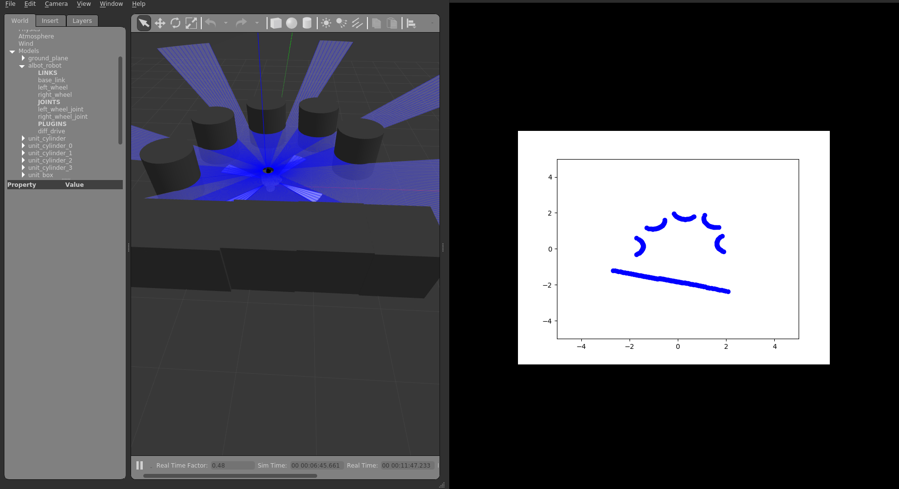
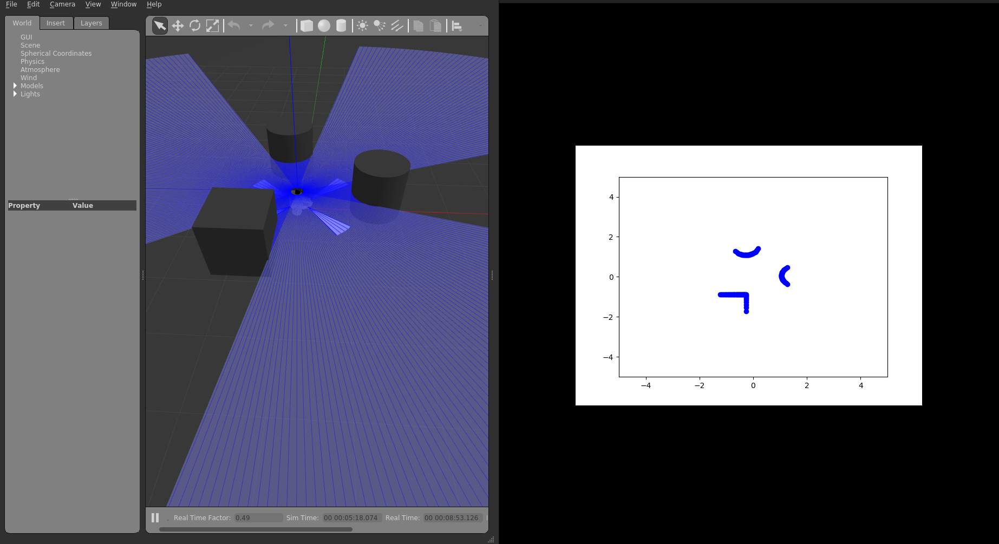

# LIDAR

This script reads */scan* topic of type *LaserScan* (sensor_msgs.msg library).

The script checks at a frequency of 10Hz if there is any object close to the robot and plots a Lidar.png graph if it finds the object.

To carry out the script tests, I used the [Pequi-Mecanico-Home/albot](https://github.com/Pequi-Mecanico-Home/albot) project by user @Pequi-Mecanico-Home .




script_name: lidar.py
package: lidar/


## Requirements
- ROS2

## Run
- Clone the repository as it contains the ROS2 package
- Do: ```colcon build # in your workspace```
- Do: ```source install/setup.bash # in your workspace```
- Do: ```ros2 run lidar lidar```
